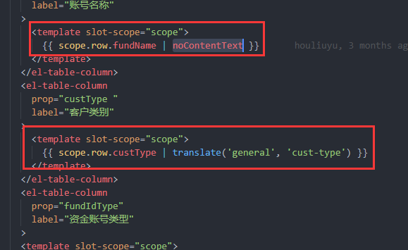

> # VUE学习笔记
>
> ## DOM
>
> ### 什么是DOM
>
> HTML DOM 是：
>
> - HTML 的标准对象模型
> - HTML 的标准编程接口
> - W3C 标准
>
> HTML DOM 定义了所有 HTML 元素的*对象*和*属性*，以及访问它们的*方法*。
>
> 换言之，HTML DOM 是关于如何获取、修改、添加或删除 HTML 元素的标准。
>
> 
>
> ## DOM 节点
>
> 根据 W3C 的 HTML DOM 标准，HTML 文档中的所有内容都是节点：
>
> - 整个文档是一个文档节点
> - 每个 HTML 元素是元素节点
> - HTML 元素内的文本是文本节点
> - 每个 HTML 属性是属性节点
> - 注释是注释节点
>
> ### HTML DOM 节点树
>
> HTML DOM 将 HTML 文档视作树结构。这种结构被称为*节点树*：
>
> #### HTML DOM Tree 实例
>
> 
>
> 通过 HTML DOM，树中的所有节点均可通过 JavaScript 进行访问。所有 HTML 元素（节点）均可被修改，也可以创建或删除节点。
>
> ### 节点父、子和同胞
>
> 节点树中的节点彼此拥有层级关系。
>
> 父（parent）、子（child）和同胞（sibling）等术语用于描述这些关系。父节点拥有子节点。同级的子节点被称为同胞（兄弟或姐妹）。
>
> - 在节点树中，顶端节点被称为根（root）
> - 每个节点都有父节点、除了根（它没有父节点）
> - 一个节点可拥有任意数量的子
> - 同胞是拥有相同父节点的节点
>
> 下面的图片展示了节点树的一部分，以及节点之间的关系：
>
> 
>
> #### 请看下面的 HTML 片段：
>
> ```
> <html>
>   <head>
>     <title>DOM 教程</title>
>   </head>
>   <body>
>     <h1>DOM 第一课</h1>
>     <p>Hello world!</p>
>   </body>
> </html>
> ```
>
> 从上面的 HTML 中：
>
> - <html> 节点没有父节点；它是根节点
>
> - <head> 和 <body> 的父节点是 <html> 节点
>
> - 文本节点 "Hello world!" 的父节点是 <p> 节点
>
> 并且：
>
> - <html> 节点拥有两个子节点：<head> 和 <body>
>
> - <head> 节点拥有一个子节点：<title> 节点
>
> - <title> 节点也拥有一个子节点：文本节点 "DOM 教程"
>
> - <h1> 和 <p> 节点是同胞节点，同时也是 <body> 的子节点
>
> 并且：
>
> - <head> 元素是 <html> 元素的首个子节点
>
> - <body> 元素是 <html> 元素的最后一个子节点
>
> - <h1> 元素是 <body> 元素的首个子节点
>
> - <p> 元素是 <body> 元素的最后一个子节点
>
> #### 警告！
>
> DOM 处理中的常见错误是希望元素节点包含文本。
>
> 在本例中：*<title>DOM 教程</title>*，元素节点 <title>，包含值为 "DOM 教程" 的*文本节点*。
>
> 可通过节点的 *innerHTML* 属性来访问文本节点的值。
>
> 
>
> ## `v-if`
>
> `v-if` 指令用于条件性地渲染一块内容。这块内容只会在指令的表达式返回 truthy 值的时候被渲染。
>
> ```html
> <h1 v-if="awesome">Vue is awesome!</h1>
> ```
>
> 
>
> 也可以用 `v-else` 添加一个“else 块”：
>
> ```html
> <h1 v-if="awesome">Vue is awesome!</h1>
> <h1 v-else>Oh no 😢</h1>
> ```
>
> 
>
> ### 在-template-元素上使用-v-if-条件渲染分组在 `<template>` 元素上使用 `v-if` 条件渲染分组
>
> 因为 `v-if` 是一个指令，所以必须将它添加到一个元素上。但是如果想切换多个元素呢？此时可以把一个 `<template>` 元素当做不可见的包裹元素，并在上面使用 `v-if`。最终的渲染结果将不包含 `<template>` 元素。
>
> ```html
> <template v-if="ok">
>   <h1>Title</h1>
>   <p>Paragraph 1</p>
>   <p>Paragraph 2</p>
> </template>
> ```
>
> 
>
> ### `v-else`
>
> 你可以使用 `v-else` 指令来表示 `v-if` 的“else 块”：
>
> ```html
> <div v-if="Math.random() > 0.5">
>   Now you see me
> </div>
> <div v-else>
>   Now you don't
> </div>
> ```
>
> 
>
> `v-else` 元素必须紧跟在带 `v-if` 或者 `v-else-if` 的元素的后面，否则它将不会被识别。
>
> ### `v-else-if`
>
> `v-else-if`，顾名思义，充当 `v-if` 的“else-if 块”，并且可以连续使用：
>
> ```html
> <div v-if="type === 'A'">
>   A
> </div>
> <div v-else-if="type === 'B'">
>   B
> </div>
> <div v-else-if="type === 'C'">
>   C
> </div>
> <div v-else>
>   Not A/B/C
> </div>
> ```
>
> 
>
> 与 `v-else` 的用法类似，`v-else-if` 也必须紧跟在带 `v-if` 或者 `v-else-if` 的元素之后。
>
> ### `v-show`
>
> 另一个用于条件性展示元素的选项是 `v-show` 指令。用法大致一样：
>
> ```html
> <h1 v-show="ok">Hello!</h1>
> ```
>
> 不同的是带有 `v-show` 的元素始终会被渲染并保留在 DOM 中。`v-show` 只是简单地切换元素的 CSS property `display`。
>
> 注意，`v-show` 不支持 `<template>` 元素，也不支持 `v-else`。
>
> ### v-if` vs `v-show
>
> `v-if` 是“真正”的条件渲染，因为它会确保在切换过程中，条件块内的事件监听器和子组件适当地被销毁和重建。
>
> `v-if` 也是**惰性的**：如果在初始渲染时条件为假，则什么也不做——直到条件第一次变为真时，才会开始渲染条件块。
>
> 相比之下，`v-show` 就简单得多——不管初始条件是什么，元素总是会被渲染，并且只是简单地基于 CSS 进行切换。
>
> 一般来说，`v-if` 有更高的切换开销，而 `v-show` 有更高的初始渲染开销。因此，如果需要非常频繁地切换，则使用 `v-show` 较好；如果在运行时条件很少改变，则使用 `v-if` 较好。
>
> ### v-if` 与 `v-for一起使用
>
> 提示
>
> **不推荐**同时使用 `v-if` 和 `v-for`。
>
> 当 `v-if` 与 `v-for` 一起使用时，`v-if` 具有比 `v-for` 更高的优先级。
>
> 
>
> ### slot-scope和scope.row
>
> 不懂看这个
>
> https://blog.csdn.net/houyibing930920/article/details/89513246?utm_medium=distribute.pc_relevant.none-task-blog-2%7Edefault%7EBlogCommendFromMachineLearnPai2%7Edefault-3.control&depth_1-utm_source=distribute.pc_relevant.none-task-blog-2%7Edefault%7EBlogCommendFromMachineLearnPai2%7Edefault-3.control
>
> 
>
> **1.slot-scope=“scope”**
> 作用域插槽中定义一个对象(这里对象被定义为scope)来存储插槽上绑定的数据的用法
>
> **2.scope.row**
> 使用ElementUI表格模板渲染数据时使用
>
> 总体上说明：
> 当前行数据的获取也会用到插槽,scope相当于一行的数据， scope.row相当于当前行的数据对象
>
> 
>
> ## 可清空单选选择器
>
> 为`el-select`设置`clearable`属性，则可将选择器清空。需要注意的是，`clearable`属性仅适用于单选。
>
> ```
> <template>
>   <el-select v-model="value" clearable placeholder="请选择">
>     <el-option
>       v-for="item in options"
>       :key="item.value"
>       :label="item.label"
>       :value="item.value">
>     </el-option>
>   </el-select>
> </template>
> 
> <script>
>   export default {
>     data() {
>       return {
>         options: [{
>           value: '选项1',
>           label: '黄金糕'
>         }, {
>           value: '选项2',
>           label: '双皮奶'
>         }, {
>           value: '选项3',
>           label: '蚵仔煎'
>         }, {
>           value: '选项4',
>           label: '龙须面'
>         }, {
>           value: '选项5',
>           label: '北京烤鸭'
>         }],
>         value: ''
>       }
>     }
>   }
> </script>
> ```
>
> # vue使用笔记
>
> ## 更换表格单个单元格颜色
>
> <!--表头添加属性 :cell-style-->
>  <el-table :data="tableData"  border size="mini"  :cell-style="addClass" >
>   	<!--列字段不做改变 只添加 prop属性 设定 label -->
>  	<el-table-column prop="workable" label="评价1" align="center"></el-table-column>
>  </el-table>
>
>  methods: {
> 	//此处实现的就是基本的逻辑处理了。
> 	//绿色记20分，黄色记10分，红色记5分
>      addClass({row,column,rowIndex,columnIndex}){
>    		 //column.label 对应列上的 label=" 评价1"
>          if (column.label==='评价1') {
>          	 //row.workable 对应列上的 prop="workable"
>              if(row.workable === 20){
>              	// 设定背景色 
>              	//这里也可以给颜色值 'background: #f57f17' ;
>                  return 'background: green;';
>              }else if(row.workable === 10){
>                  return 'background: yellow;';
>              }else if(row.workable === 5){
>                  return 'background: red;';
>              }
>          }else if(column.label==='评价2'){
>              if(row.planQuality === 20){
>                  return 'background: green;';
>              }else if(row.planQuality === 10){
>                  return 'background: yellow;';
>              }else if(row.planQuality === 5){
>                  return 'background: red;';
>              }
>          }else if(column.label==='评价3'){
>              if(row.publicity === 20){
>                  return 'background: green;';
>              }else if(row.publicity === 10){
>                  return 'background: yellow;';
>              }else if(row.publicity === 5){
>                  return 'background: red;';
>              }
>          }else if(column.label==='评价4'){
>              if(row.photo === 20){
>                  return 'background: green;';
>              }else if(row.photo === 10){
>                  return 'background: yellow;';
>              }else if(row.photo === 5){
>                  return 'background: red;';
>              }
>          }else if(column.label==='评价5'){
>              if(row.implement === 20){
>                  return 'background: green;';
>              }else if(row.implement === 10){
>                  return 'background: yellow;';
>              }else if(row.implement === 5){
>                  return 'background: red;';
>              }
>          }else if(column.label==='综合评价'){
>              //绿：(80-100]，  黄：[60,80],  红：[25，60)
>              if(80<row.complex && row.complex <=100){
>                  return 'background: green;';
>              }else if(60<=row.complex &&row.complex <=80){
>                  return 'background: yellow;';
>              }else if(25<=row.complex && row.complex<60){
>                  return 'background: red;';
>              }
>          }
>      },
> }
>
> 
>
> ## 对templete,script,div标签的理解
>
> #### templete
>
> **实际上 元素是被当做一个不可见的包裹元素，主要用于分组的条件判断和列表渲染。**
>
> 我们知道 .vue 文件的基本结构是：
>
> [](javascript:void(0);)
>
> ```
> <template>
>        ........
> </template>
> 
> <script>
>     export default {
>         name: "demo"
> 
>     }
> </script>
> 
> <style scoped>
> 
>     .demo {
>           font-size: 28px;
>     }
> 
> </style>    
> ```
>
> [](javascript:void(0);)
>
> 上面template标签，我们都知道是用来写 html 模板的，且内部必须只有一个根元素，像这样（不然报错）
>
> ```
> <template>
>     <div class="demo">
>         .....
>     </div>
> </template>
> ```
>
> 但有时候我们也会看到，这样的写法，在template上使用for循环：
>
>  
>
> [](javascript:void(0);)
>
> ```
> <template>
>     <div class="root">
>         <!--在template上使用for循环-->
>         <template v-for="item,index in 5">
>             <div>{{index}}---{{item}}</div>
>         </template>
>     </div>
> </template>
> ```
>
> [](javascript:void(0);)
>
> 下面我们来看一下template是什么:
>
> ```
> <template>
>     <div class="root">
>         <template>看看外面的标签是什么</template>
>     </div>
> </template>
> ```
>
> 在浏览器中解析完的结果：
>
> 
>
>  
>
>  可以看到文字外面是 div.root ，所以本质上的<template>标签并没有什么意义。
>
> 所以我们再来看一下刚才的循环：
>
> [](javascript:void(0);)
>
> ```
> <template>
>     <div class="root">
> 
>         <template v-for="item,index in 5">
>             <div>测试{{index}}</div>
>         </template>
> 
>     </div>
> </template>
> ```
>
> [](javascript:void(0);)
>
> 浏览器解析后的效果：
>
> 
>
>  
>
>  可以看出这样写,类似平常这样写：
>
> [](javascript:void(0);)
>
> ```
> <template>
>     <div class="root">
> 
>         <div v-for="item,index in 5">
>             <div>测试{{index}}</div>
>         </div>
> 
>     </div>
> </template>
> ```
>
> [](javascript:void(0);)
>
> 但是这样循环出来会多出一层div来
>
> 
>
>  
>
>  所以我们有时候,不需要这外层的 div 所以我们可以采用上面 的方法，在 <template>标签上使用 v-for来循环。或者这样写：
>
> [](javascript:void(0);)
>
> ```
> <template>
>     <div class="root">
> 
>         <div v-for="item,index in 5" :key="index">测试{{index}}</div>
> 
>     </div>
> </template>
> ```
>
> [](javascript:void(0);)
>
> ####  script
>
> ##### 标签定义及使用说明
>
> <script> 标签用于定义客户端脚本，比如 JavaScript。
>
> <script> 元素既可包含脚本语句，也可以通过 "src" 属性指向外部脚本文件。
>
> JavaScript 通常用于图像操作、表单验证以及动态内容更改。
>
> ------
>
> ##### 提示和注释
>
> **注释：**如果使用 "src" 属性，则 <script> 元素必须是空的。
>
> **提示：**请参阅 [](https://www.runoob.com/tags/tag-noscript.html) 元素，对于那些在浏览器中禁用脚本或者其浏览器不支持客户端脚本的用户来说，该元素非常有用。
>
> **注释：** 有多种执行外部脚本的方法：
>
> - 如果 async="async"：脚本相对于页面的其余部分异步地执行（当页面继续进行解析时，脚本将被执行）
> - 如果不使用 async 且 defer="defer"：脚本将在页面完成解析时执行
> - 如果既不使用 async 也不使用 defer：在浏览器继续解析页面之前，立即读取并执行脚本
>
> 
>
> #### div
>
> ##### 定义和用法
>
> <div> 可定义文档中的分区或节（division/section）。
>
> <div> 标签可以把文档分割为独立的、不同的部分。它可以用作严格的组织工具，并且不使用任何格式与其关联。
>
> 如果用 id 或 class 来标记 <div>，那么该标签的作用会变得更加有效。
>
> ##### 用法
>
> <div> 是一个块级元素。这意味着它的内容自动地开始一个新行。实际上，换行是 <div> 固有的唯一格式表现。可以通过 <div> 的 class 或 id 应用额外的样式。
>
> 不必为每一个 <div> 都加上类或 id，虽然这样做也有一定的好处。
>
> 可以对同一个 <div> 元素应用 class 或 id 属性，但是更常见的情况是只应用其中一种。这两者的主要差异是，class 用于元素组（类似的元素，或者可以理解为某一类元素），而 id 用于标识单独的唯一的元素。
>
> 
